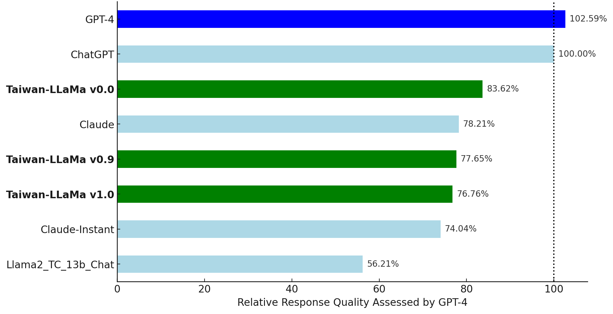

# Taiwanese-Aligned Language Models

<p align="center">
✍️ <a href="https://huggingface.co/spaces/yentinglin/Taiwan-LLaMa2" target="_blank">Online Demo</a>  
•
🤗 <a href="https://huggingface.co/yentinglin" target="_blank">HF Repo</a> • 🐦 <a href="https://twitter.com/yentinglin56" target="_blank">Twitter</a> • 📃 <a href="https://arxiv.org/pdf/2305.13711.pdf" target="_blank">[Paper Coming Soon]</a>  
• 👨️ <a href="https://yentingl.com/" target="_blank">Yen-Ting Lin</a>  
</p>

[](https://github.com/tatsu-lab/stanford_alpaca/blob/main/LICENSE)
[](https://github.com/tatsu-lab/stanford_alpaca/blob/main/DATA_LICENSE)


## Overview
Taiwan-LLaMa is a fine-tuned model based on LLaMa2 for traditional chinese application.

## Demo
A live demonstration of the model can be accessed at [Hugging Face Spaces](https://huggingface.co/spaces/yentinglin/Taiwan-LLaMa2).

## Model

We provide a number of model checkpoints that we trained. You can find them on Hugging Face [here](https://huggingface.co/models?search=taiwan-llama). Here are some quick links to the checkpoints that are finetuned from LLaMa 2:

| **Model**                                              | **13B**                                                                                                                       | 
|--------------------------------------------------------|-------------------------------------------------------------------------------------------------------------------------------|
| **Taiwan-LLaMa v1.0**                                  | 🤗 <a href="https://huggingface.co/yentinglin/Taiwan-LLaMa-v1.0" target="_blank">yentinglin/Taiwan-LLaMa-v1.0</a>  | 
| Taiwan-LLaMa v0.9 (partial instruction set)            | 🤗 <a href="https://huggingface.co/yentinglin/Taiwan-LLaMa-v0.9" target="_blank">yentinglin/Taiwan-LLaMa-v0.9</a>  | 
| Taiwan-LLaMa v0.0 (no Traditional Chinese pretraining) | 🤗 <a href="https://huggingface.co/yentinglin/Taiwan-LLaMa-v0.0" target="_blank">yentinglin/Taiwan-LLaMa-v0.0</a>  | 

## Data

Here are some quick links to the datasets that we used to train the models:

| **Dataset**                     | **Link**                                                                                                                      | 
|---------------------------------|-------------------------------------------------------------------------------------------------------------------------------|
| **Instruction-tuning**      | 🤗 <a href="https://huggingface.co/datasets/yentinglin/traditional_chinese_instructions" target="_blank">yentinglin/traditional_chinese_instructions</a>                                           | 
| Traditional Chinese Pretraining | 🤗 <a href="https://huggingface.co/datasets/yentinglin/zh_TW_c4" target="_blank">yentinglin/zh_TW_c4</a>                                   | 


## Vicuna Bench (Traditional Chinese Version): Relative Scores with ChatGPT as baseline



The scores are calculated with ChatGPT as the baseline, represented as 100%. The other values show the relative performance of different models compared to ChatGPT.

| Language Model                      | Relative Score (%) |
|-------------------------------------|--------------------|
| GPT-4                               | 102.59%            |
| ChatGPT                             | 100.00%            |
| **Taiwan-LLaMa v0.0**               | 83.62%             |
| Claude-2.0                          | 78.21%             |
| **Taiwan-LLaMa v0.9**               | 77.65%             |
| **Taiwan-LLaMa v1.0**               | 76.76%             |
| Claude-Instant-1.2                  | 74.04%             |
| Llama2_Traditional_Chinese_13b_Chat | 56.21%             |


## How to deploy model on my own machine?
We recommend hosting models with [🤗 Text Generation Inference](https://github.com/huggingface/text-generation-inference). Please see their [license](https://github.com/huggingface/text-generation-inference/blob/main/LICENSE) for details on usage and limitations.
```bash
bash run_text_generation_inference.sh "yentinglin/Taiwan-LLaMa" NUM_GPUS DIR_TO_SAVE_MODEL PORT MAX_INPUT_LEN MODEL_MAX_LEN
```

## Setup development environment
```bash
conda create -n taiwan-llama python=3.10 -y 
conda activate taiwan-llama
pip install -r requirements.txt
```


## Citation
If you use our code, data, or models in your research, please cite this repository. You can use the following BibTeX entry:

```bibtex
@misc{taiwanllama,
    author={Yen-Ting Lin},
    title={Taiwanese-Aligned Language Models based on Meta-Llama2},
    year={2023},
    url={https://github.com/adamlin120/Taiwan-LLaMa},
    note={Code and models available at https://github.com/adamlin120/Taiwan-LLaMa},
}
```

## License
The code in this project is licensed under the Apache 2.0 License - see the [LICENSE](LICENSE) file for details.

The models included in this project are licensed under the LLAMA 2 Community License. See the [LLAMA2 License](https://github.com/facebookresearch/llama/blob/main/LICENSE) for full details.

## OpenAI Data Acknowledgment
The data included in this project were generated using OpenAI's models and are subject to OpenAI's Terms of Use. Please review [OpenAI's Terms of Use](https://openai.com/policies/terms-of-use) for details on usage and limitations.


## Acknowledgements

We thank [Meta LLaMA team](https://github.com/facebookresearch/llama) and [Vicuna team](https://github.com/lm-sys/FastChat) for their open-source efforts in democratizing large language models.
